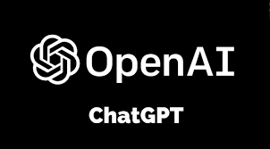

<!-- PROJECT SHIELDS -->
<!--
*** I'm using markdown "reference style" links for readability.
*** Reference links are enclosed in brackets [ ] instead of parentheses ( ).
*** See the bottom of this document for the declaration of the reference variables
*** for contributors-url, forks-url, etc. This is an optional, concise syntax you may use.
*** https://www.markdownguide.org/basic-syntax/#reference-style-links
-->

[![MIT License][license-shield]][license-url]
[![LinkedIn][linkedin-shield]][linkedin-url]

<!-- PROJECT LOGO -->
 

  

  <h3 align="center">Intro ChatGPT Chatbot Template</h3>

  

    A very basic template to create your first Chatbot using GPT!
     
    <a href="https://github.com/AMM93/ChatGPTPython_Intro"><strong>Explore the docs »</strong></a>
     
     
    <a href="https://github.com/AMM93/ChatGPTPython_Intro">View Demo</a>
    ·
    <a href="https://github.com/AMM93/ChatGPTPython_Introissues">Report Bug</a>
    ·
    <a href="https://github.com/AMM93/ChatGPTPython_Intro">Request Feature</a>
  

<!-- ABOUT THE SCRIPT -->
## About The Script

This will be an introduction to more complex scripts for OpenAI using Python

Here's why:
* Your time should be focused on creating something amazing. A project that solves a problem and helps others
* You shouldn't be doing the same tasks over and over like creating a README from scratch
* You should implement DRY principles to the rest of your life :smile:

<!-- LICENSE -->
## License

Distributed under the MIT License. See `LICENSE.txt` for more information.

(<a href="#readme-top">back to top</a>)

<!-- CONTACT -->
## Contact

Antonio Moreno Martín - ant.moreno.martin@gmail.com

Project Link: [https://github.com/AMM93/ChatGPTPython_Intro)

(<a href="#readme-top">back to top</a>)

